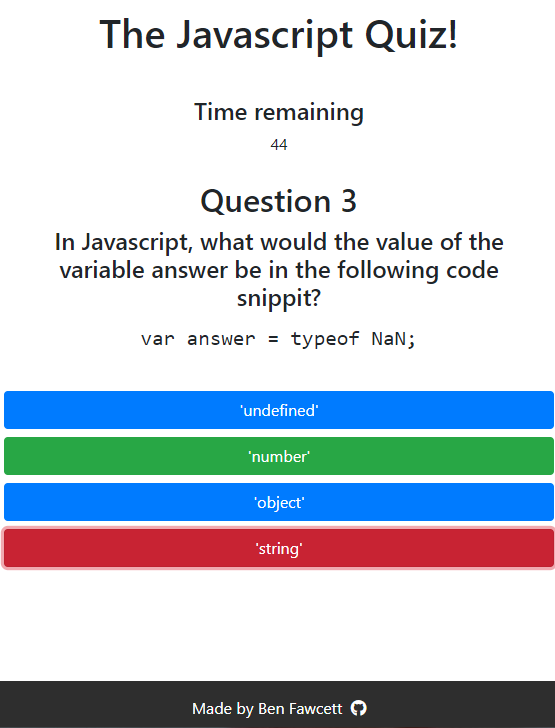

# The Javascript Quiz!

[Try it here!](https://hexagonatron.github.io/TheJavascriptQuiz/)

## Goal

The goal here was to create a timer based quiz about javascript. Once users have run out of time or reached the last question, their score will be saved in local storage.

## Screenshot

## Technologies used

* HTML
* CSS
* Javascript
* [Bootstrap](https://getbootstrap.com/)
* [FontAwesome](https://fontawesome.com/)

## Author

Ben Fawcett